# Entity Relationship Diagram

| Field | Value |
|---|---|
| Status | Draft (high-level; per-table specs in sibling files) |
| Last updated | 2026-05-21 |
| Owner | Engineering |

A visual map of the core entities and how they relate. Per-table column-level specs live in the other files in this folder.

## Core diagram

```mermaid
erDiagram
    PEOPLE ||--o{ WORK_ORDERS : "is contractor on"
    PEOPLE ||--o{ PROPERTY_ASSIGNMENTS : "is assigned to (recruiter/PM)"
    PEOPLE ||--o{ PEOPLE_EXTERNAL_IDS : "has external IDs"
    PEOPLE ||--o{ UNIFORM_DEDUCTION_SCHEDULES : "owes for uniforms"
    PEOPLE ||--o{ TIME_ENTRIES : "creates / is contractor on"
    PEOPLE ||--o{ TIME_ENTRY_ADJUSTMENTS : "receives"

    PROPERTIES ||--o{ PROPERTY_DEPARTMENTS : "has"
    PROPERTIES ||--o{ PROPERTY_POSITION_RATES : "has rate for"
    PROPERTIES ||--o{ CONTRACTS : "has"
    PROPERTIES ||--o{ WORK_ORDERS : "hosts"
    PROPERTIES ||--o{ PROPERTY_ASSIGNMENTS : "is assigned to people"
    PROPERTIES ||--o{ PAYROLL_PERIODS : "has"

    POSITIONS ||--o{ PROPERTY_POSITION_RATES : "has rate at"
    POSITIONS ||--o{ WORK_ORDERS : "is title for"

    WORK_ORDERS ||--o{ TIME_ENTRIES : "anchors"
    WORK_ORDERS ||--o{ TIME_ENTRY_ADJUSTMENTS : "anchors"
    WORK_ORDERS ||--o{ TIME_SUMMARIES : "anchors"

    PAYROLL_PERIODS ||--o{ TIME_ENTRIES : "contains"
    PAYROLL_PERIODS ||--o{ TIME_SUMMARIES : "contains"
    PAYROLL_PERIODS ||--|| TIMESHEETS : "is summarized by"

    TIME_ENTRIES }o--|| TIME_SUMMARIES : "rolls up into"

    TIMESHEETS ||--|| INVOICES : "produces"
    INVOICES ||--o{ INVOICE_ITEMS : "has lines"
    INVOICES ||--o{ INVOICE_ADJUSTMENTS : "has adjustments"
    INVOICES ||--o| INVOICES : "voids/replaces"

    ADJUSTMENT_ITEMS ||--o{ TIME_ENTRY_ADJUSTMENTS : "templates"

    DEVICES ||--o{ TIME_ENTRIES : "creates clock events on"
    PROPERTIES ||--o{ DEVICES : "hosts"

    WORKFLOWS ||--o{ WORKFLOW_STEPS : "has"
    WORKFLOW_DEFINITIONS ||--o{ WORKFLOWS : "defines"

    STOCK_ISSUANCES ||--|| UNIFORM_DEDUCTION_SCHEDULES : "creates"
    UNIFORM_DEDUCTION_SCHEDULES ||--o{ UNIFORM_DEDUCTION_SCHEDULE_ENTRIES : "has"

    KB_ARTICLES ||--o{ KB_ARTICLE_VERSIONS : "has versions"
    KB_ARTICLES }o--o{ KB_CATEGORIES : "in"
    KB_ARTICLES }o--o{ KB_TAGS : "tagged"
    KB_ARTICLES }o--o{ ROLES : "role-gated by"
    KB_ARTICLES ||--o{ KB_ATTACHMENTS : "has"

    FEEDBACK }o--|| KB_ARTICLES : "is on (polymorphic)"

    ACTIVITY_LOG }o--|| ANY_MODEL : "audits (polymorphic)"
    FILES }o--|| ANY_MODEL : "attached to (polymorphic)"
```

## Key entity groups

### People & identity
- `people` (one row per identity, with status)
- `people_external_ids` (hotel-specific identifiers)
- Spatie tables: `roles`, `permissions`, `model_has_roles`, `model_has_permissions`, `role_has_permissions`

### Property Bible
- `properties` (profile)
- `property_departments` (per-property departments + managers)
- `positions` (global catalog)
- `property_position_rates` (per-property rates with effective dates)
- `contracts` (per-property contract documents)
- `property_assignments` (M2M people ↔ properties with role context — recruiter/PM)

### Work orders & time
- `work_orders` (contractor + property + position + rates; with `is_temporary_assignment` flag per ADR-0019 and `more_staff_request_id` FK per ADR-0021)
- `payroll_periods` (per property per week)
- `time_entries` (raw events; with `clock_method`, GPS, selfie fields per ADR-0017)
- `time_summaries` (materialized weekly rollups)
- `adjustment_items` (catalog — no uniform entries; supply_request generates adjustments separately)
- `time_entry_adjustments` (applied; with `source_type` discriminator per ADR-0014)
- `devices` (tablets — backup flow) + token authentication
- `field_visits` (recruiter check-ins per ADR-0017 — separate from time_entries; not billable)

### Workflows + denormalized records
- `workflows` and `workflow_steps` (generalized engine)
- `workflow_definitions` (seeded types)
- `termination_records` (snapshot per ADR-0018)
- `pay_increase_requests` (snapshot per ADR-0020)
- `more_staff_requests` (with `quantity_fulfilled` tracking per ADR-0021)
- `pto_year_allotments`, `pto_grants`, `pto_requests` (per ADR-0016)
- `contractor_charge_schedules` + `contractor_charge_schedule_entries` (renamed from `uniform_deduction_*` per ADR-0014)
- `import_batches` + `import_batch_rows` (per ADR-0008)
- `equipment_assignments` (per ADR-0012)

### Timesheets & invoicing
- `timesheets` (one per period, state machine)
- `invoices` (one per timesheet, frozen)
- `invoice_items` (per-work-order lines, snapshots)
- `invoice_adjustments` (per-adjustment lines, snapshots)

### Workflows
- `workflow_definitions` (seeded types)
- `workflows` (instances)
- `workflow_steps` (executions)

### Knowledge base
- `kb_articles`, `kb_article_versions`, `kb_categories`, `kb_tags`
- `kb_article_category`, `kb_article_tag`, `kb_article_role` (pivots)
- `kb_attachments`

### Inventory
- `products`, `product_variants`
- `stock_receipts`, `stock_issuances`
- `contractor_charge_schedules`, `contractor_charge_schedule_entries` (formerly `uniform_deduction_*`; see ADR-0014)

### Cross-cutting (polymorphic)
- `activity_log` (audits any model)
- `files` (attaches to any model)
- `feedback` (polymorphic feedback, currently used by KB)

## Color-coded zones (conceptual)

| Color | Concern |
|---|---|
| Blue | People + identity |
| Green | Property Bible (reference data) |
| Orange | Time tracking + work orders |
| Purple | Timesheets + invoicing |
| Yellow | Workflows |
| Gray | Knowledge base |
| Brown | Inventory |
| Red | Audit + PII |

Visual ERD with colors is TBD — to be generated from this diagram once the schema migrations are written. Mermaid can output color blocks; we'll add them when the table definitions stabilize.

## Notably absent

By design:

- **No `tenant_id` anywhere.** See ADR-0002.
- **No separate `users` + `employees` + `applicants`.** All collapsed to `people`. See ADR-0004.
- **No live computation of bill/payout amounts in reports.** Materialized in `time_summaries`. See ADR-0008.
- **No editable invoices.** Frozen + void/reissue. See ADR-0006.

## Related

- `30-schema/conventions.md` — naming, types, money handling
- `30-schema/people-tables.md`, `property-tables.md`, etc. (TBD per section)
- All `20-domain/*` files for the conceptual model
